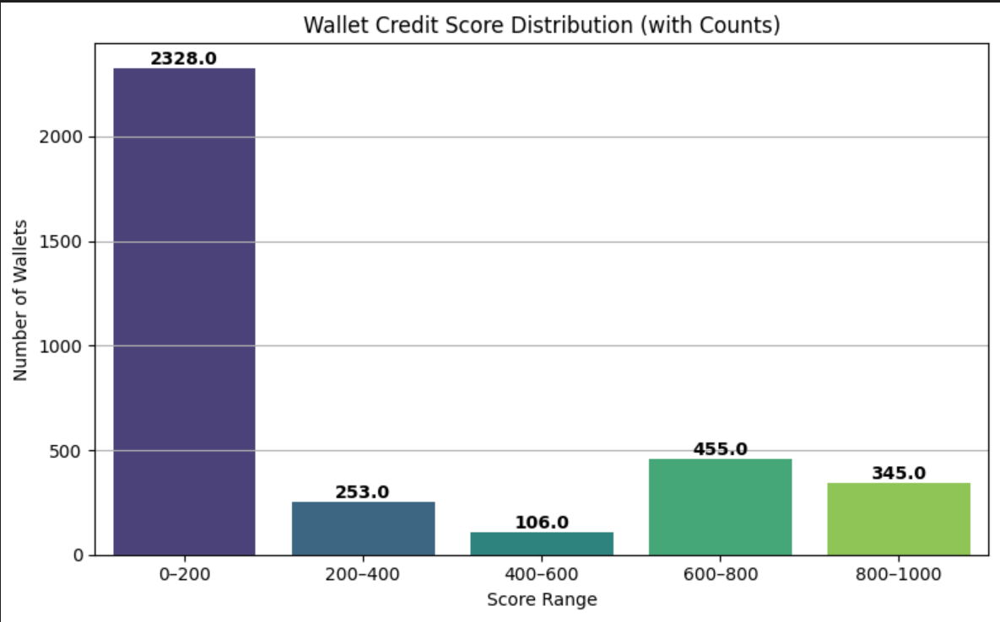

# DeFi-Credit-Scoring

This project assigns a credit score (ranging from 0 to 1000) to blockchain wallet addresses based on their historical transaction behavior with the Aave V2 protocol. The score reflects how responsible and trustworthy the wallet appears based on DeFi interactions such as deposits, borrows, repayments, redemptions, and liquidations.

## Objective

To process raw DeFi transaction data and generate a score per wallet address indicating reliability. This scoring logic is based on financial behavior patterns and is designed to identify risky, bot-like, or irresponsible usage versus legitimate users.

## Input

- A JSON file containing raw transaction data
- Each transaction includes:
  - `userWallet`
  - `action` (deposit, borrow, repay, redeemunderlying, liquidationcall)
  - `amount` and `assetPriceUSD`
  - `timestamp`

## Output

- A JSON file mapping each wallet to a credit score between 0 and 1000
- A bar chart showing the distribution of scores
- (Optional) Model-based predictions using a trained XGBoost regressor

## Methodology

- Cleaned and flattened the raw JSON transaction data
- Grouped transactions by wallet address
- Engineered wallet-level features:
  - Count of actions (`deposit_count`, `borrow_count`, etc.)
  - Total USD value for each action type
  - Number of active days
  - Repayment ratio (`total_repay_usd / total_borrow_usd`)
- Applied a rule-based scoring formula to assign scores based on:
  - Healthy usage of deposits and repays
  - Responsible borrow-repay behavior
  - No liquidation activity
- (Bonus) Trained an XGBoost regression model to predict scores using these features

## Technologies Used

- Python 3
- pandas
- matplotlib / seaborn
- scikit-learn
- xgboost

## Files

- `wallet_credit_scores.json` – Final output mapping wallet → score
- `score_distribution.png` – Visualization of score ranges
- `wallet.ipynb` – Full vscode and jupiter Notebook with data cleaning, scoring logic, and optional ML
- `analysis.md` – Score distribution analysis and model evaluation
- `user-wallet-transaction.JSON` - This is the raw user data  

## How to Run

1. Install required packages:
   ```bash
   pip install pandas xgboost scikit-learn matplotlib seaborn
   Place the transaction data in the root directory

Run the notebook step by step to:

Process data

Generate credit scores

Train and evaluate model (optional)

Output results to wallet_credit_score.JSON

Notes
Credit scoring logic is explainable and extensible.

Scores are scaled to the 0–1000 range for intuitive comparison.

The ML model replicates the rule-based logic with high accuracy (R² ≈ 0.999).