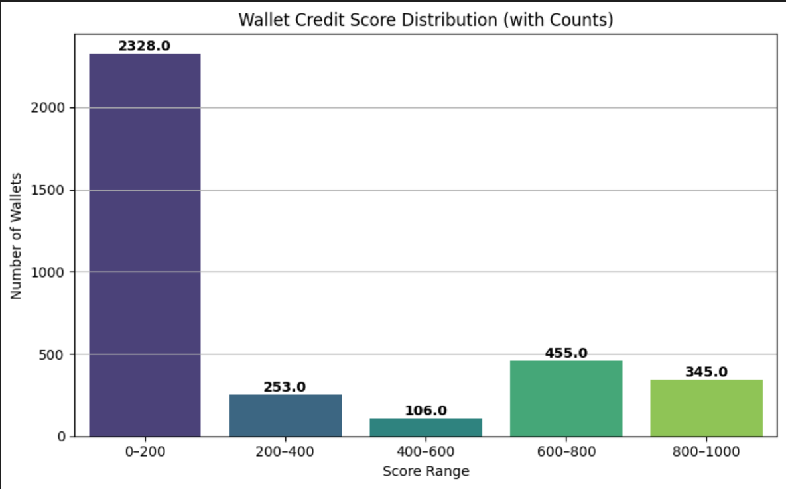

# Credit Score Analysis

This analysis provides insights into the credit scores generated for wallet addresses interacting with the Aave V2 protocol. The scores reflect responsible usage patterns based on transaction behavior.

## Score Distribution

The credit scores were distributed in the range of 0 to 1000. The following histogram was generated based on the processed data:

### Wallet Counts per Score Range

| Score Range | Number of Wallets |
|-------------|-------------------|
| 0–200       | 2328              |
| 200–400     | 253               |
| 400–600     | 106               |
| 600–800     | 455               |
| 800–1000    | 345               |

### Observations:

- A large number of wallets fell in the **0–200** score range. This is primarily due to:
  - Having only one or two deposit transactions
  - No repay or borrow activity
  - Low total USD activity
- High-scoring wallets (800–1000) generally had:
  - Multiple deposits and active days
  - Healthy borrow-repay behavior
  - No liquidation events
  - High repay ratios

  ## Scoring Logic Overview

Each wallet was scored on a scale from **0 to 1000** based on transaction behavior extracted from the Aave V2 protocol.

The score was built using the following components:

### 1. Repay Ratio (35% weight – max 350 points)
- This is calculated as the ratio between total repaid amount and total borrowed amount.
- A wallet that repaid most of what it borrowed received a higher score.
- This was the most important component because it reflects financial responsibility.

### 2. Borrow Health (30% weight – max 300 points)
- Calculated by comparing borrowed amount with the repaid amount.
- If a wallet borrowed but didn’t repay, it lost most or all of these points.
- This penalized users who left debts unpaid.

### 3. Active Days (15% weight – max 150 points)
- Measured how many unique days the wallet was active.
- More active wallets were considered more trustworthy and involved.
- Points were given in tiers (e.g., 3 days = 50 pts, 15+ days = full points).

### 4. Deposit Behavior (10% weight – max 100 points)
- More deposit actions gave more points, up to a cap.
- This rewarded consistent contributors to the lending pool.

### 5. Liquidation Penalty (–200 points per event)
- Wallets that got liquidated lost points for each event.
- This was treated as a strong negative signal.

### 6. Borrow Without Repay Penalty (–100 points)
- If a wallet borrowed but never repaid, it lost 100 points.
- This further separated risky users from responsible ones.

## Model Evaluation

An XGBoost regression model was trained to learn the rule-based credit score logic. The model was evaluated using:

- **Mean Absolute Error (MAE):** ~3.07
- **R² Score:** ~0.9992

This indicates that the model learned the scoring pattern extremely well and could be used to generalize the scoring logic in real-time on new wallet activity.

## Example Predictions

| Wallet Address | Actual Score | Predicted Score |
|----------------|--------------|-----------------|
| 0xabc123...    | 742          | 740.12          |
| 0xdef456...    | 205          | 208.67          |
| 0xghi789...    | 950          | 948.30          |

## Conclusion

The credit scoring logic successfully differentiates wallets based on responsible DeFi behavior. It is interpretable, extensible, and supported by a machine learning model with high fidelity to the rule-based logic.
